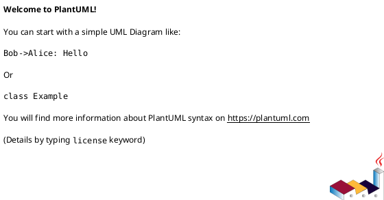

# draw-with-plantuml

Generate a PlantUML diagram based on real code in the workspace.

## Required Arguments

1. `diagramType`: one of `class`, `dependency`, `sequence`
2. `classPath`: workspace-relative path to the class file

## Interactive Argument Prompting

If the user runs `/draw-with-plantuml` without one or both arguments, prompt for missing values before doing any analysis.

Ask in this order:

1. `diagramType` with choices: `class`, `dependency`, `sequence`
2. `classPath` as free-text path to the class file

Do not continue until both values are provided.

## Invocation Format

`/draw-with-plantuml diagramType=<class|dependency|sequence> classPath=<path/to/ClassFile>`

Optional short form (interactive):

`/draw-with-plantuml`

## Behavior

1. Validate inputs.
2. Read the target class from `classPath`.
3. Discover related code by following imports/usings, base classes, interfaces, and direct call references.
4. Build the selected diagram from actual code only. Do not invent classes, methods, or relations.
5. Return:
   - brief analysis summary
   - PlantUML code block
   - assumptions or unresolved symbols (if any)

## Diagram Rules

### `class`

- Include the target class and directly related classes/interfaces.
- Show inheritance/implementation and key fields/methods used for relationships.
- Prefer concise visibility and signatures.

### `dependency`

- Focus on dependency edges from the target class to collaborators.
- Include constructor-injected dependencies, imported static collaborators, and major external services.
- Label edge intent when obvious from code (for example: `calls`, `creates`, `uses`).

### `sequence`

- Build a representative runtime interaction centered on the target class.
- Use a primary public method as entry point if no method is specified.
- Show participant order and key calls derived from real call flow in code.
- If call flow cannot be resolved statically, state limitations explicitly.

## Output Template

~~~text
Summary:
- ...

PlantUML:

Notes:
- ...
~~~

## Validation and Errors

- If `diagramType` is invalid, return accepted values.
- If `classPath` does not exist or is not a class file, return a clear error and suggest closest matches.
- If parsing is partial, continue with available facts and list gaps.
- If any required argument is missing, ask for it interactively instead of failing.

## Examples

`/draw-with-plantuml diagramType=class classPath=src/domain/OrderService.ts`

`/draw-with-plantuml diagramType=dependency classPath=backend/services/PaymentService.cs`

`/draw-with-plantuml diagramType=sequence classPath=app/core/UserManager.java`
